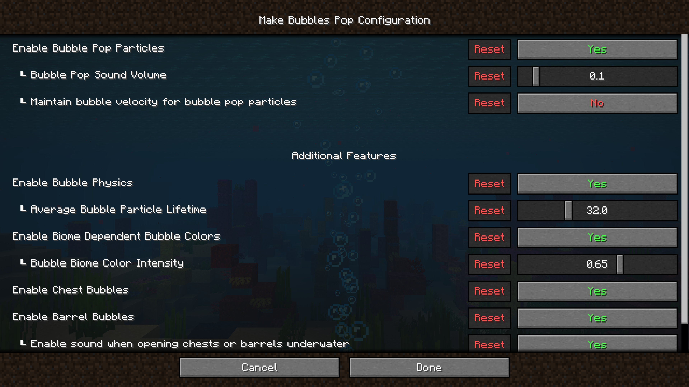
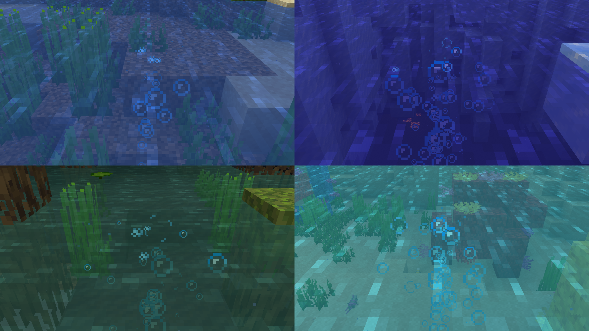

- **Support for Minecraft 1.21** ⚔️ (closes [#13](https://github.com/Tschipcraft/make_bubbles_pop/issues/13), [#14](https://github.com/Tschipcraft/make_bubbles_pop/issues/14), [#15](https://github.com/Tschipcraft/make_bubbles_pop/issues/15))
- **Added config file and settings menu when installed alongside [MidnightLib](https://modrinth.com/mod/midnightlib)** (closes [#4](https://github.com/Tschipcraft/make_bubbles_pop/issues/4))
  

  
🔎 In game screenshot

  
  

- **Added entity interaction physics to bubbles** (configurable)
  

  
🔎 In game demo

  <video src="demo/bubble_entity_interactions.mp4" autoplay loop muted>Your browser does not support the video tag or the video doesn't exist anymore.</video>
  

- **Added biome dependent tint to all bubble types** (configurable)
  

  
🔎 In game screenshot

  
  

- **Fixed barrels opened by other players on servers not emitting bubbles** (closes [#11](https://github.com/Tschipcraft/make_bubbles_pop/issues/11)) (Thanks @AViewFromTheTop)
- Adjusted current down bubbles to pop on top of magma blocks rather than inside them (closes [#9](https://github.com/Tschipcraft/make_bubbles_pop/issues/9))
  

  
🔎 In game demo

  <video src="demo/overhauled_magma_block_bubbles-v0.3.0.mp4" autoplay loop muted>Your browser does not support the video tag or the video doesn't exist anymore.</video>
  

- Added varied pitch and volume to bubble pop and bubble swirl sounds (closes [#8](https://github.com/Tschipcraft/make_bubbles_pop/issues/8)) (Thanks @AViewFromTheTop)
- Barrel bubbling is now reliable on the client and will no longer bubble when a chunk with an already opened Barrel is loaded (Thanks @AViewFromTheTop)
- Fixed checking incorrect side of barrels for bubble particles
- Changed the default behavior to not maintain bubble particle velocity when popping (configurable) (Thanks @AViewFromTheTop)
- Tweaked explosion bubbles and used better variable names
- Restructured bubble particle logic and used better variable types
- Adjusted barrel bubble spawn locations
- Moved bubble pop logic to a separate utility class to reduce code duplication
- Simplified water checks to use the already provided helper function in world or level
- Fixed literal new line in fabric.mod.json after building (closes [#12](https://github.com/Tschipcraft/make_bubbles_pop/issues/12))
